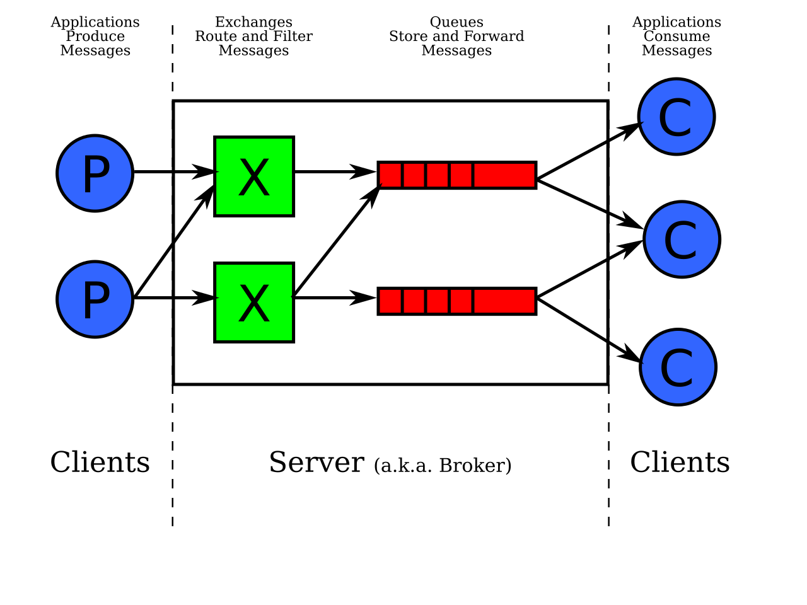

En este trabajo se simulan las operaciones de agregar un producto al carrito de compras, editar la cantidad del producto, consultar el carrito y realizar el pedido. Se trabaja en español salvo por los términos tomados de la especificación de AMQP. 

Usando como base el patrón MVC y el framework de Spring se crea un CarritoController que va a realizar las cuatro operaciones. Las clases CarritoDTO y ProductoDTO definen la estructura de estos dos objetos. Exchange se encarga de recibir y almacenar los mensajes, en este caso estos mensajes pueden ir a una de dos colas (hay 2 consumidores de mensajes: los clientes y el vendedor). Los mensajes tienen algunas de las propiedades detalladas en AMQP pero cuentan con datos diferenciales por lo que se usan las clases concretas ClienteMensaje y VendedorMensaje.

Para simular que los consumidores se suscriben a la cola y consumen sus mensajes se crea la clase Client que tiene al Exchange para poder acceder a los mensajes de las colas. Client toma el mensaje y lo procesa (el método procesarMensaje solo imprime un mensaje porque realmente no tiene lógica dentro). CarritoController tiene el método procesarMensajesClientes para poder recrear el consumo de los mensajes por los clientes.

En esta instancia no se considera que los mensajes puedan ser rechazados y volver a la cola, el consumidor siempre las procesa con éxito.

Se habla de consumidores (clientes y vendedores) pero la clase se llama Client para seguir con los nombres que tiene el siguiente gráfico visto en clase:

Las peticiones se probaron con Bruno y para poder probar la consulta de un carrito se agrega una lista dentro de CarritoController.

Ejemplos de invocación

- agregarProducto
POST http://localhost:8080/apicarrito/agregarProducto/123

ejemplo de producto1
{
  "idProducto": "LNTJ0022",
  "nombre": "lentejas",
  "cantidad": 3
}

ejemplo de producto2
{
  "idProducto": "AZCR0343",
  "nombre": "azucar",
  "cantidad": 1
}

- actualizarProducto
PUT http://localhost:8080/apicarrito/actualizarProducto/123

{
  "idProducto": "AZCR0343",
  "nombre": "azucar",
  "cantidad": 5
}

- verCarrito
GET http://localhost:8080/apicarrito/123

- crearPedido
POST http://localhost:8080/apicarrito/crearPedido/123

