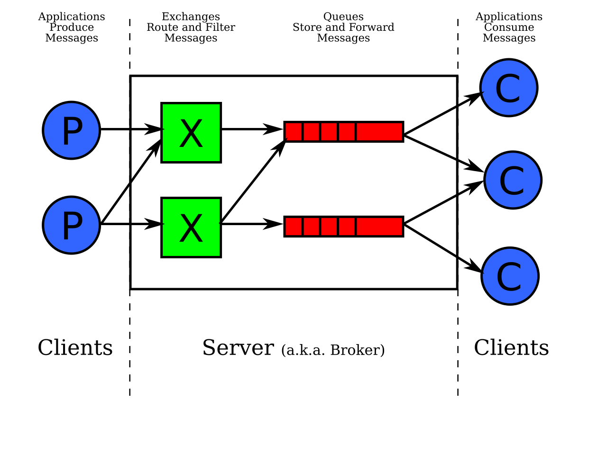

En este trabajo se simulan las operaciones de agregar un producto al carrito de compras, editar la cantidad del producto, consultar el carrito y realizar el pedido. Se trabaja en español salvo por los términos tomados de la especificación de AMQP. 

Usando como base el patrón MVC y el framework de Spring se crea un CarritoController que va a realizar las cuatro operaciones. Las clases CarritoDTO y ProductoDTO definen la estructura de estos dos objetos. Exchange se encarga de recibir y almacenar los mensajes, en este caso estos mensajes pueden ir a una de dos colas (hay 2 consumidores de mensajes: los clientes y el vendedor). Los mensajes tienen algunas de las propiedades detalladas en AMQP pero cuentan con datos diferenciales por lo que se usan las clases concretas ClienteMensaje y VendedorMensaje.

Para simular que los consumidores se suscriben a la cola y consumen sus mensajes se crea la clase Client que tiene al Exchange para poder acceder a los mensajes de las colas. Client toma el mensaje y lo procesa (el método procesarMensaje solo imprime un mensaje porque realmente no tiene lógica dentro). CarritoController tiene el método procesarMensajesClientes para poder recrear el consumo de los mensajes por los clientes.

En esta instancia no se considera que los mensajes puedan ser rechazados y volver a la cola, el consumidor siempre las procesa con éxito.

Se habla de consumidores (clientes y vendedores) pero la clase se llama Client para seguir con los nombres que tiene el siguiente gráfico visto en clase:

Las peticiones se probaron con Bruno y para poder probar la consulta de un carrito se agrega una lista dentro de CarritoController.

Ejemplos de invocación

- agregarProducto
POST http://localhost:8080/apicarrito/agregarProducto/123

ejemplo de producto1
{
  "idProducto": "LNTJ0022",
  "nombre": "lentejas",
  "cantidad": 3
}

ejemplo de producto2
{
  "idProducto": "AZCR0343",
  "nombre": "azucar",
  "cantidad": 1
}

- actualizarProducto
PUT http://localhost:8080/apicarrito/actualizarProducto/123

{
  "idProducto": "AZCR0343",
  "nombre": "azucar",
  "cantidad": 5
}

- verCarrito
GET http://localhost:8080/apicarrito/123

- crearPedido
POST http://localhost:8080/apicarrito/crearPedido/123

***

Sobre el TP-3

Como ya venía trabajando con Maven las dependencias necesarias se agregaron al proyecto como se indica en la página de [Maven Repository](https://mvnrepository.com/) y siempre tratando de que sea la última versión. Estas fueron spock-core (v. 2.4-M4-groovy-4.0) y groovy-all (v. 4.0.23). Como plugins para poder integrar Groovy al proyecto se usaron gmavenplus-plugin (v. 4.0.1) y maven-surefire-plugin (v. 3.5.2). Dentro de build-pluginManagement en el archivo POM se incluyó también gmavenplus-plugin para que efectivamente se puedan ejecutar los tests.

***

Sobre el TP-4

Ahora que se agrega una base de datos existen dos tipos de Carritos: los que están en memoria (en el Map de CarritoController) que existen mientras la aplicación se está ejecutando y los que están en la base de datos (cuando se usa MyBatis) que persisten y no están relacionados con el Map. Las operaciones que se realizan sobre los carritos están separadas, unas se realizan con los endpoints y tiene los test para validar su correcto funcionamiento y las otras se realizan con MyBatis. 

Se podrían unir estos carritos haciendo modificaciones en el CarritoController para que al agregarse un nuevo carrito en el HashMap carritos se agregue un registro a la base y así mismo si se agrega o modifica un producto que esto se vea reflejado en la base y que además al inicar la aplicación se cargue el carrito del CarritoController con los registros de la base de datos. Pero por motivos de prueba decidí que cada tipo de operación sea independiente de la otra. Esto significó agregar nuevas clases para trabajar con los carritos y los productos (están basadas en sus tablas son las que en el material para este TP se llamó clases POJO, los nombres son Carrito y Producto). Para mantener la claridad y la limpieza en el proyecto todas las operaciones relacionadas con la base de datos están en otro controlador llamado CarritoDBController (se separan las responsabilidades).

Para poder trabajar con MyBatis en el proyecto se modificó el archivo POM, las nuevas dependencias son las de mybatis (v. 3.5.16) y el conector de mysql para java mysql-connector-j (v. 9.1.0). Los mappers con las consultas SQL están en la carpeta del mismo nombre dentro de resources. Hay un archivo para las operaciones en la tabla de los carritos y otro para la que relaciona los productos con los carritos. Y las interfaces que se usan en el controlador están también en una carpeta llamada mappers.

Algo debe estar fallando en la configuración o las versiones que incluso probando con @Autowired e indicando que la interface es @Mapper el mapper es nulo.